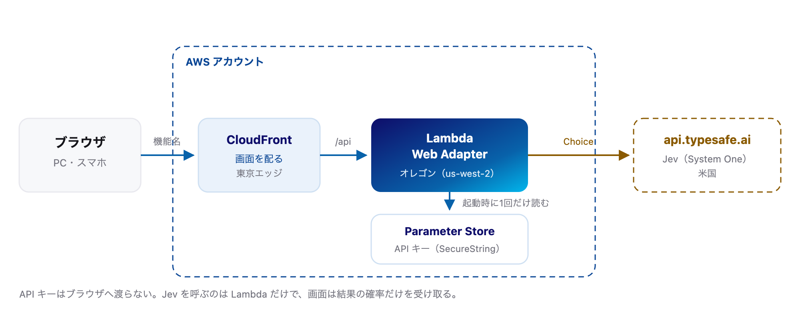

# Jev クラウド判定

三大クラウド（AWS / Azure / Google Cloud）の機能名を選ぶと、どのクラウドのものかを
[Jev](https://typesafe.ai)（TypeSafe AI の System One モデル）が確率つきで判定するデモです。

Jev は文章を生成せず、選択肢に対する確率分布を1回の並列パスで返します。画面の3本の棒は、
モデルが返した `probabilities` をそのまま描いたものです。

**デモ: https://dxtmc35dbmyei.cloudfront.net/**

出題は30問で、ブランド名（Amazon / AWS / Azure / Google）は外してあります。三社で役割の似た
ものを揃えてあるので、名前だけでは判別しにくくなっています。迷う問題では Jev の confidence が
下がり、棒の長さも割れます。

## 仕組み



API キーはブラウザへ渡らず、Lambda だけが持ちます。判定 API を置く Lambda は、Jev との往復を
最短にするためオレゴン（us-west-2）で動かしています。画面そのものは CloudFront のエッジから届きます。

## 開発

```bash
npm install
export TYPESAFE_API_KEY=<APIキー>

# サーバー（/api/classify と静的配信）
npm run serve

# 画面だけホットリロードしたいとき（/api は上のサーバーへプロキシ）
npm run dev
```

## デプロイ

API キーを SecureString で置いてから、CDK（cdkd）でデプロイします。

```bash
aws ssm put-parameter \
  --name /jev-classifier/typesafe-api-key \
  --type SecureString \
  --value "<APIキー>" \
  --region us-west-2

npm run infra:dry-run
npm run infra:deploy
```

## ライセンス

Apache License 2.0
